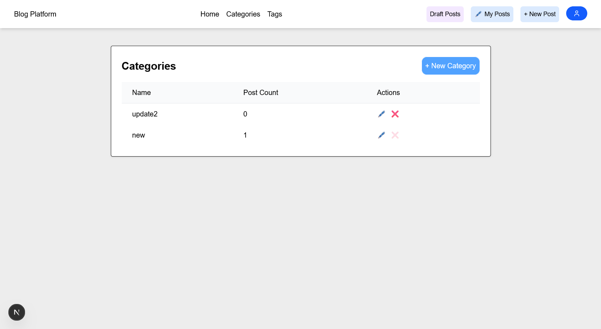

# 📝 Blog App

## Getting Started

A full-stack Blog application built with:

- **Frontend**: [Next.js](https://nextjs.org/) (React, Tailwind CSS)
- **Backend**: [Spring Boot](https://spring.io/projects/spring-boot) (Java)
- **Database**: [PostgreSQL](https://www.postgresql.org/)

## 🔐 Authentication

Authentication with JWT-based authentication, with:

- Access Tokens: Used for authenticating user sessions.

- Refresh Tokens: Used to renew expired access tokens.

Key components:

- jsonwebtoken (for signing and verifying tokens)

- JwtAuthenticationFilter (Spring Security filter to authenticate requests)

- DTOs for clean request/response structures

- Custom Error Controller for centralized error handling

## 🚀 Features

- User registration & login (JWT-secured)
- Create, edit, delete posts, categories and tags
- View and manage posts
- RESTful API built with Spring Boot
- PostgreSQL for persistent storage

## 📦 Setup

### 1. Clone the Repo

```bash
git clone https://github.com/Hfanes/java-blog
cd java-blog
```

### 2. Backend

```bash
cd blog-backend
```

Create .env or update application.properties or application.yml:

```bash
spring.application.name=blog
jwt.secret=${JWT_SECRET}
server.port=

#DB Connection
spring.datasource.url=jdbc:postgresql://localhost:5433/blog
spring.datasource.username=
spring.datasource.password=

#JPA Configuration
#to update db
spring.jpa.hibernate.ddl-auto=update
spring.jpa.show-sql=true
spring.jpa.properties.hibernate.format_sql=true
spring.jpa.properties.hibernate.dialect=org.hibernate.dialect.PostgreSQLDialect
```

Run the backend:

```bash
./mvnw spring-boot:run
```

#### (Optional) Database container

Setup your docker-compose file

```bash
services:
  db:
    image: postgres:latest
    ports:
      - "5433:5432"
    restart: always
    environment:
      POSTGRES_DB:
      POSTGRES_USER:
      POSTGRES_PASSWORD: ${DB_PASSWORD}

  #Database management interface
  adminer:
    image: adminer:latest
    restart: always
    ports:
      - 8888:8080

```

Run your database container

```bash
docker-compose up
```

API should be available at: http://localhost:8080

### 3. Frontend Setup (Next.js)

```bash
cd blog-frontend
npm install
npm run dev
```

App runs at: http://localhost:3000

### 5. 🧪 API Endpoints

Auth

    POST /api/v1/auth/login - User login

    POST /api/v1/auth/register - User registration

    POST /api/v1/auth/refresh - Refresh access token

    POST /api/v1/auth/logout - User logout

    GET /api/v1/auth/{userId} - Get user by ID

Categories

    GET /api/v1/categories - Get all categories

    POST /api/v1/categories - Create a new category

    PUT /api/v1/categories/{categoryId} - Update category

    DELETE /api/v1/categories/{categoryId} - Delete category

Tags

    GET api/v1/tags - Get all tags

    POST api/v1/tags - Create tag

    PUT api/v1/tags/{tagId} - Update tag

    DELETE api/v1/tags/{tagId} - Delete tag

Posts

    GET /api/v1/posts - Get all posts

    GET /api/v1/posts/drafts - Get all draft posts

    GET /api/v1/posts/{postId} - Get post by ID

    GET /api/v1/posts/my-posts - Get posts by author/user

    POST /api/v1/posts - Create post

    PUT /api/v1/posts/{postId} - Update post

    DELETE /api/v1/posts/{postId} - Delete post

### 4. Preview

#### Home


#### Categories



#### Posts


#### Edit post


#### User posts


#### New post


#### Single post


